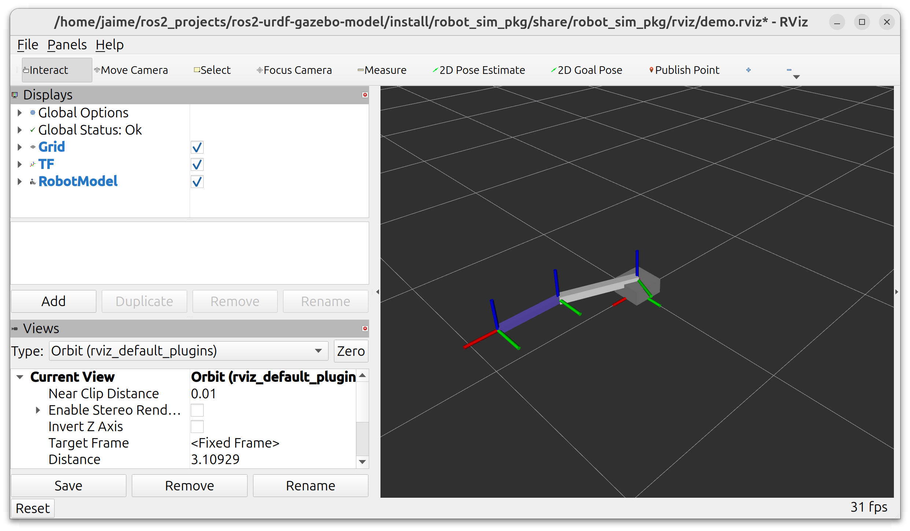
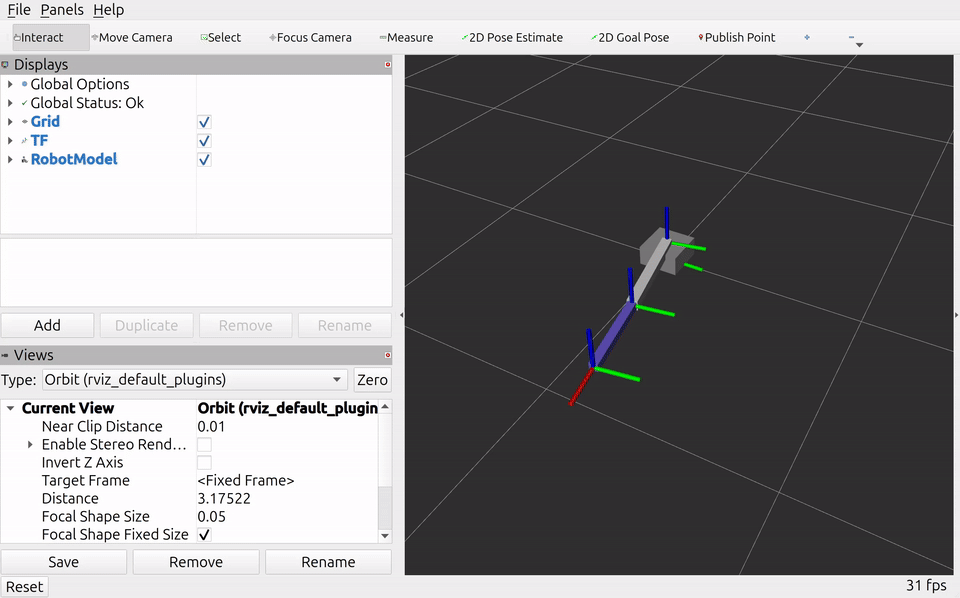
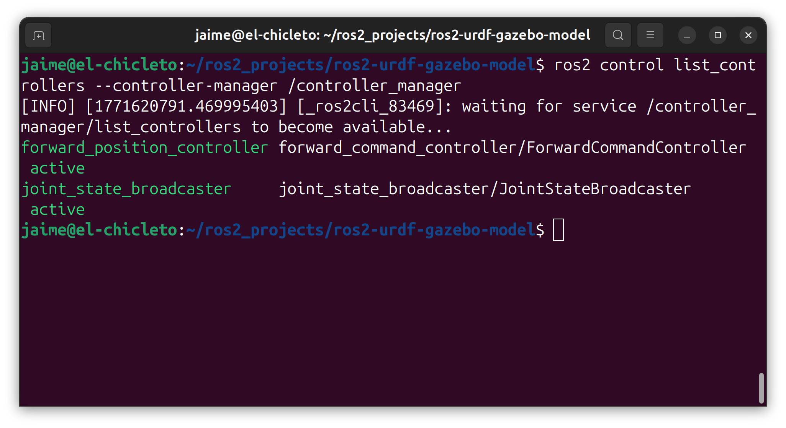
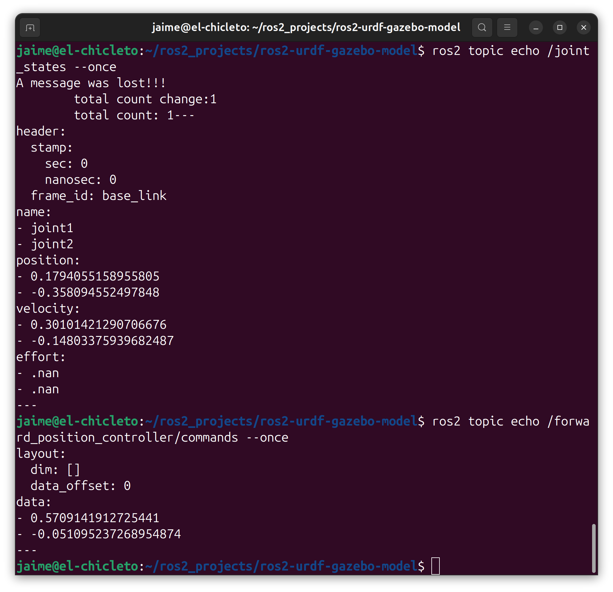
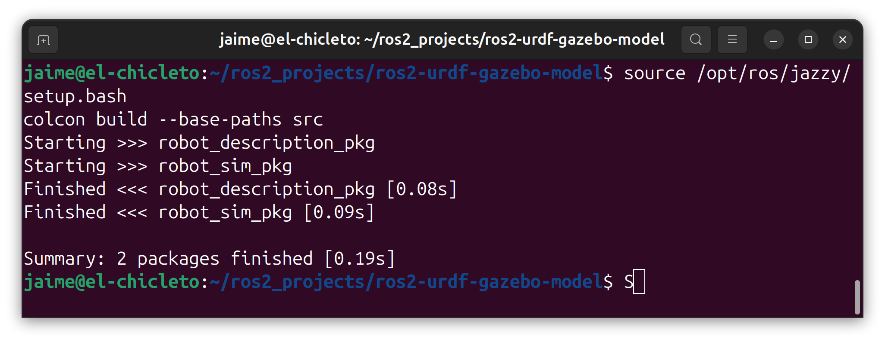

# ROS 2 URDF Gazebo Model Workspace

This repository is a ROS 2 workspace for a two-link robot simulation using:
- `robot_description_pkg` for URDF/Xacro assets
- `robot_sim_pkg` for launch files, controller config, RViz config, and C++ nodes

## Workspace Structure

```text
ros2-urdf-gazebo-model/
├── src/
│   ├── robot_description_pkg/
│   │   └── urdf/
│   └── robot_sim_pkg/
│       ├── config/
│       ├── launch/
│       ├── rviz/
│       └── src/
├── build/      # generated
├── install/    # generated
└── log/        # generated
```



## Prerequisites

- Ubuntu with ROS 2 installed
- Tested on ROS 2 Jazzy
- `colcon` available
- ROS 2 packages used by this workspace:
  - `xacro`
  - `robot_state_publisher`
  - `rviz2`
  - `controller_manager`
  - `ros2_control`
  - `ros2_controllers`
  - `ros_gz_sim`
  - `gz_ros2_control`

Install dependencies:

```bash
sudo apt update
sudo apt install -y \
  ros-jazzy-ros-gz-sim \
  ros-jazzy-gz-ros2-control \
  ros-jazzy-ros2-control \
  ros-jazzy-ros2-controllers
```

## Build

Run from the workspace root:

```bash
source /opt/ros/jazzy/setup.bash
colcon build --base-paths src
source install/setup.bash
```

## Run

### 1. Visualize Description Only

```bash
source /opt/ros/jazzy/setup.bash
source install/setup.bash
ros2 launch robot_sim_pkg demo_rviz.launch.py
```

### 2. WSL2-Safe Simulation (Headless Gazebo + RViz + Controllers) (Recommended)

```bash
source /opt/ros/jazzy/setup.bash
source install/setup.bash
ros2 launch robot_sim_pkg gazebo_headless_rviz.launch.py
```

This launch starts:
- `robot_state_publisher`
- Gazebo server (`gz sim`) in headless mode
- `joint_state_broadcaster`
- `forward_position_controller`
- RViz2

Use this mode on WSL2 when NVIDIA driver / OpenGL issues make Gazebo GUI unstable.

### 3. Native Gazebo GUI Simulation (Modern Gazebo)

```bash
source /opt/ros/jazzy/setup.bash
source install/setup.bash
ros2 launch robot_sim_pkg gazebo_gui.launch.py
```

This mode runs the same simulation/control stack with the Gazebo GUI enabled.



## Useful Checks

```bash
ros2 control list_controllers --controller-manager /controller_manager
ros2 topic echo /joint_states --once
ros2 topic echo /forward_position_controller/commands --once
```




## Architecture View


## Reproducibility Snapshot

```bash
source /opt/ros/jazzy/setup.bash
colcon test --base-paths src
source install/setup.bash
colcon test-result --verbose
```



## Key Files

- Robot model entrypoint: `src/robot_description_pkg/urdf/two_link_arm.urdf.xacro`
- URDF model file: `src/robot_description_pkg/urdf/two_link_arm.urdf`
- Controller config: `src/robot_sim_pkg/config/controllers.yaml`
- RViz-only launch: `src/robot_sim_pkg/launch/demo_rviz.launch.py`
- WSL2-safe headless + RViz launch: `src/robot_sim_pkg/launch/gazebo_headless_rviz.launch.py`
- Gazebo GUI launch: `src/robot_sim_pkg/launch/gazebo_gui.launch.py`
- Joint command node: `src/robot_sim_pkg/src/joint_command_node.cpp`

## Troubleshooting

- Launch changes are not reflected:
  - Rebuild and re-source:
    ```bash
    colcon build --base-paths src
    source install/setup.bash
    ```
- Error: `Failed to load system plugin [libgz_ros2_control-system.so] : Could not find shared library.`  
  Cause: `gz_ros2_control` is not installed or its plugin path is missing.
  - Install dependency:
    ```bash
    sudo apt update
    sudo apt install -y ros-jazzy-gz-ros2-control
    ```
  - Verify install:
    ```bash
    ros2 pkg prefix gz_ros2_control
    find /opt/ros/jazzy -name libgz_ros2_control-system.so
    ```
  - Re-source and relaunch:
    ```bash
    source /opt/ros/jazzy/setup.bash
    source install/setup.bash
    ros2 launch robot_sim_pkg gazebo_headless_rviz.launch.py
    ```
- Robot appears disconnected in RViz and does not move in mode 2:
  - Check controller state:
    ```bash
    ros2 control list_controllers --controller-manager /controller_manager
    ```
    Expected `active`: `joint_state_broadcaster`, `forward_position_controller`.
  - Check joint state stream:
    ```bash
    ros2 topic echo /joint_states --once
    ```
  - If controllers are not active, relaunch mode 2 after sourcing:
    ```bash
    source /opt/ros/jazzy/setup.bash
    source install/setup.bash
    ros2 launch robot_sim_pkg gazebo_headless_rviz.launch.py
    ```

## Notes

- `.gitignore` excludes generated ROS 2 workspace artifacts (`build/`, `install/`, `log/`) and editor/system files.
- On WSL2 + NVIDIA, Gazebo GUI can be unstable; use mode 2 (`gazebo_headless_rviz.launch.py`) as the default stable workflow.
