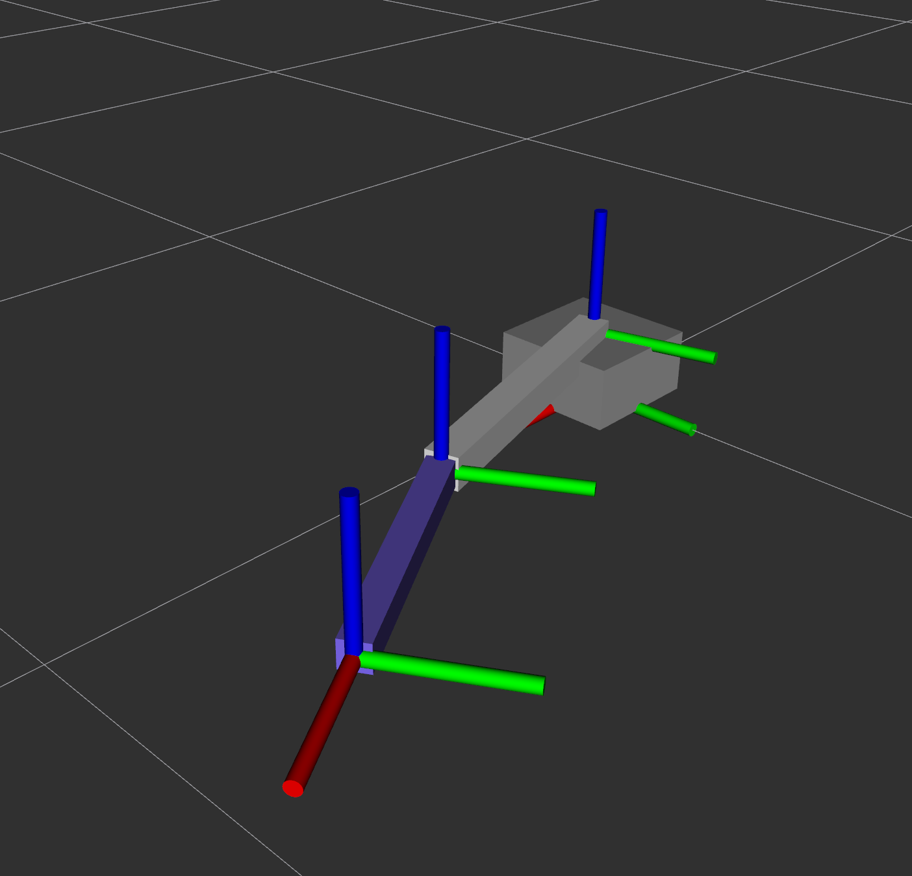

# ros2-urdf-gazebo-model Portfolio

## Title
ROS 2 Two-Link Arm Simulation with URDF Validation, Headless Gazebo, and C++ Joint Control



## Problem Statement
This project addresses a common robotics setup problem: getting a physically meaningful robot model running in simulation with reproducible control behavior.

The goals were:
- Build a URDF/Xacro model with valid inertial, collision, and joint limit data.
- Run the model in modern Gazebo (`gz sim`) with `ros2_control`.
- Drive joints from C++ nodes and observe behavior through ROS topics and RViz.

## System Architecture
The repository is organized as a ROS 2 workspace with two packages:
- `robot_description_pkg`: URDF/Xacro model files.
- `robot_sim_pkg`: C++ nodes, controller config, RViz config, and launch files.

Runtime data flow:
- `robot_state_publisher` publishes `robot_description` and TF.
- `ros_gz_sim` spawns the robot in Gazebo (headless on WSL2-safe mode, GUI on native mode).
- `gz_ros2_control` exposes `/controller_manager`.
- `joint_command_node` publishes commands to `/forward_position_controller/commands`.
- `joint_state_broadcaster` publishes `/joint_states` for RViz monitoring.


## Technical Implementation
- Robot model: `src/robot_description_pkg/urdf/two_link_arm.urdf.xacro`
- Controller config: `src/robot_sim_pkg/config/controllers.yaml`
- WSL2-safe launch (headless Gazebo + RViz): `src/robot_sim_pkg/launch/gazebo_headless_rviz.launch.py`
- Native Gazebo GUI launch: `src/robot_sim_pkg/launch/gazebo_gui.launch.py`
- C++ command node: `src/robot_sim_pkg/src/joint_command_node.cpp`

The model uses two revolute joints (`joint1`, `joint2`), a fixed base (`world_to_base`), and a fixed end-effector frame (`ee_link`).

### Software Stack
- ROS 2 Jazzy
- C++ (`rclcpp`)
- `ros2_control`, `ros2_controllers`, `controller_manager`
- modern Gazebo integration: `ros_gz_sim` + `gz_ros2_control`
- RViz2 for visualization
- URDF/Xacro for robot description

### Core Engineering Decisions
- Use C++ nodes for command and state-publishing behavior to keep control logic explicit (`robot_sim_node`, `joint_command_node`).
- Keep a WSL2-safe headless Gazebo + RViz mode as the default due GUI rendering issues on some WSL2/NVIDIA setups.
- Split launch files by use-case:
  - RViz-only model check (`demo_rviz.launch.py`)
  - WSL2-safe headless + RViz simulation (`gazebo_headless_rviz.launch.py`)
  - Native Gazebo GUI simulation (`gazebo_gui.launch.py`)
- Use `forward_command_controller` with position interface for a simple, readable control path.

## Key Challenges and Solutions
- Modern Gazebo GUI can crash on some WSL2 + NVIDIA renderer paths.
  - Solution: provide a dedicated headless + RViz mode and a separate GUI mode.
- Controller startup originally blocked when plugin/config paths were inconsistent.
  - Solution: keep `gz_ros2_control` plugin and controller YAML wired through the installed package paths.
- Robot initially toppled during early setup.
  - Solution: anchor base with `world` link and fixed `world_to_base` joint.

## Results
- URDF parses successfully and link chain is valid (`world -> base_link -> link1 -> link2 -> ee_link`).
- In headless Gazebo mode, both controllers load and activate:
  - `joint_state_broadcaster`
  - `forward_position_controller`
- `joint_command_node` publishes sinusoidal commands at 50 Hz and robot joint states update accordingly.


## Reproducibility
Install dependencies:

```bash
sudo apt update
sudo apt install -y \
  ros-jazzy-ros-gz-sim \
  ros-jazzy-gz-ros2-control \
  ros-jazzy-ros2-control \
  ros-jazzy-ros2-controllers
```

Build and run the WSL2-safe mode:

```bash
source /opt/ros/jazzy/setup.bash
colcon build --base-paths src
source install/setup.bash
ros2 launch robot_sim_pkg gazebo_headless_rviz.launch.py
```

If you are running on Ubuntu with working graphics drivers, you can also reproduce the system using Gazebo GUI mode:

```bash
source /opt/ros/jazzy/setup.bash
colcon build --base-paths src
source install/setup.bash
ros2 launch robot_sim_pkg gazebo_gui.launch.py
```

Validation commands:

```bash
ros2 control list_controllers --controller-manager /controller_manager
ros2 topic echo /joint_states --once
ros2 topic echo /forward_position_controller/commands --once
check_urdf src/robot_description_pkg/urdf/two_link_arm.urdf
```

Key files for replication:
- `README.md`
- `src/robot_description_pkg/urdf/two_link_arm.urdf.xacro`
- `src/robot_sim_pkg/config/controllers.yaml`
- `src/robot_sim_pkg/launch/gazebo_headless_rviz.launch.py`
- `src/robot_sim_pkg/launch/gazebo_gui.launch.py`
- `src/robot_sim_pkg/launch/demo_rviz.launch.py`
- `src/robot_sim_pkg/src/joint_command_node.cpp`
- `src/robot_sim_pkg/src/robot_sim_node.cpp`


## What to Improve
- Add automated validation scripts that compare command vs state trajectories over a fixed run window.
- Add CI checks for launch and controller activation so regressions are caught early.
- Add rosbag-based metrics export (joint tracking error, limit compliance) for repeatable benchmark plots.
- Add CI smoke checks for both WSL2-safe headless mode and Gazebo GUI mode.
